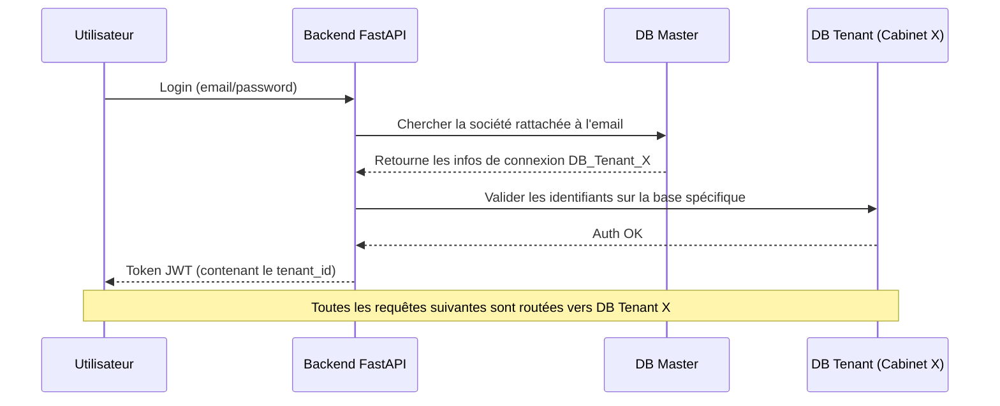

# Architecture Multi-Tenant (Multi-DB)

Cette architecture s'inspire du fonctionnement de **Sage X3**, privilégiant une isolation physique totale des données par cabinet/société.

## 1. Concept de "Dossier"
Chaque client (Cabinet ou Société) possède son propre "Dossier" qui correspond à une base de données PostgreSQL indépendante.

### Avantages
- **Sécurité maximale** : Aucune fuite de données possible entre clients au niveau SQL.
- **Maintenance isolée** : Possibilité de sauvegarder, restaurer ou migrer un seul client sans impacter les autres.
- **Performances** : Les index et les tables restent de taille réduite par base.

---

## 2. Structure des Bases de Données

### A. Base de Données MASTER (Le Superviseur)
C'est la base centrale utilisée par le Super Admin et le système pour le routage.

| Table | Rôle |
|-------|------|
| `societes` | Infos légales (NINEA, Logo, Nom) |
| `tenants_db` | Configuration de connexion (Host, DBName, User, Password) |
| `super_admins` | Identifiants pour la console d'administration |
| `audit_logs_global` | Traçabilité des créations de dossiers |

### B. Bases de Données TENANTS (Les Dossiers)
Chaque base contient l'intégralité du schéma applicatif :
- **Patients & Dossiers Médicaux**
- **Consultations & Odontogrammes**
- **Facturation & Comptabilité**
- **Stocks & Fournisseurs**
- **Utilisateurs locaux** (Praticiens, Secrétaires du cabinet)

---

## 3. La Console d'Administration (EXE)

Pour gérer ce parc de bases de données, un outil dédié (Console EXE) sera mis en place pour automatiser les tâches suivantes :

1.  **Provisionnement** :
    - Création de la base de données sur le serveur PostgreSQL.
    - Exécution des scripts SQL / Migrations Alembic pour initialiser le schéma.
    - Création du premier compte administrateur du cabinet.
2.  **Maintenance** :
    - Mise à jour groupée de tous les dossiers lors d'une nouvelle version.
    - Monitoring de l'espace disque par dossier.
    - Sauvegardes automatisées.

---

## 4. Flux de Connexion (Dynamic Routing)

---

## 5. Comparaison avec Sage X3

| Concept Sage X3 | Équivalent SysDent Pro |
|-----------------|------------------------|
| **Dossier** | Base de données PostgreSQL dédiée |
| **Console de configuration** | Console EXE de provisionnement |
| **Solution (Runtime)** | Backend FastAPI avec routage dynamique |
| **Site** | Entité `Cabinet` au sein du dossier |
