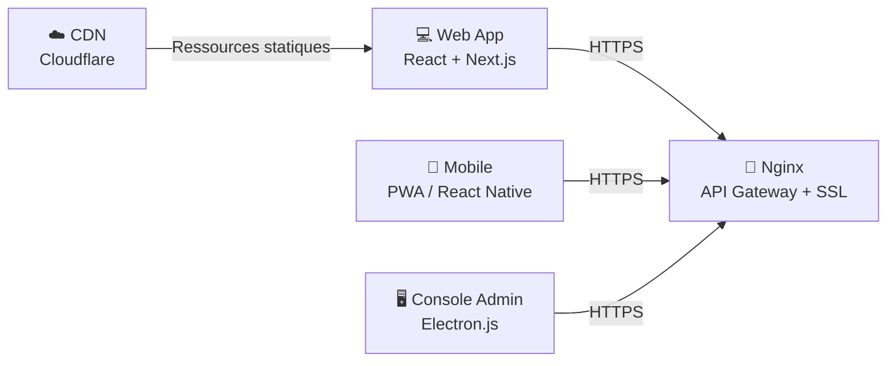
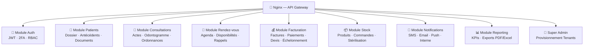
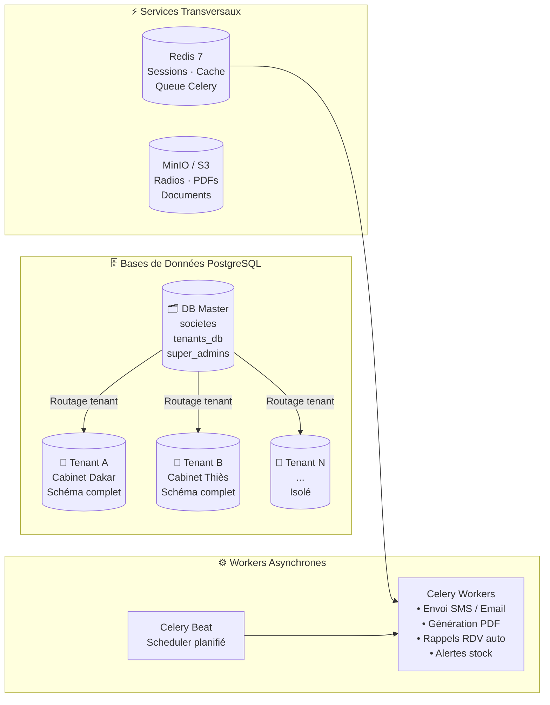
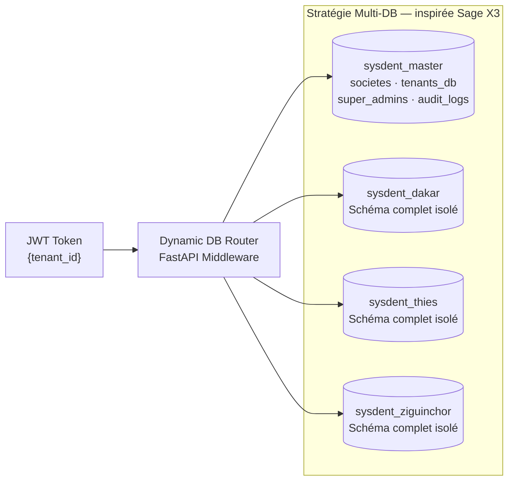
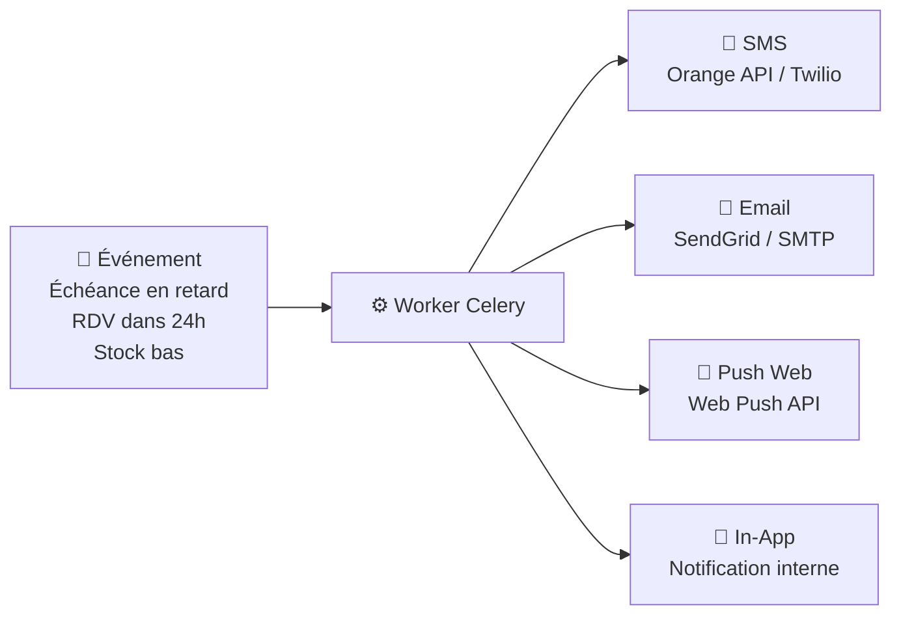
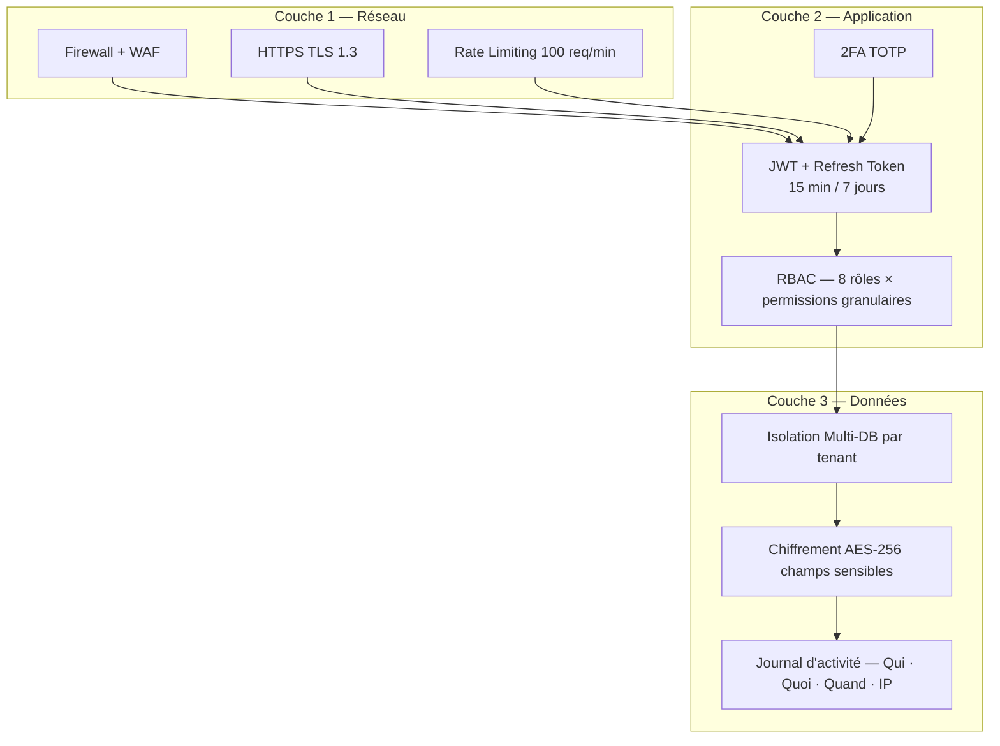
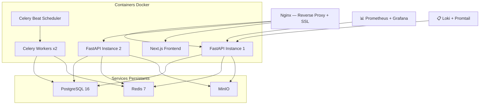
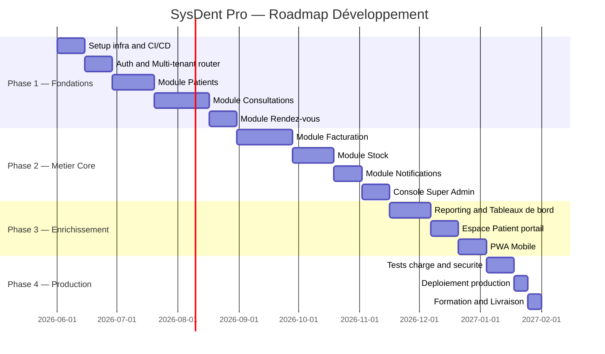

# SysDent Pro — Proposition d'Architecture Technique

> Basé sur la section **9.4 – Recommandation finale** de la modélisation SysDent Pro.  
> Architecture proposée, raisonnée et détaillée pour le lancement du développement.

---

## 🏆 Architecture Recommandée : Monolithe Modulaire

!!! important "Choix stratégique"
    Après analyse du projet, nous **déconseillons les micro-services** pour la phase initiale de SysDent Pro. L'architecture retenue est le **Monolithe Modulaire**, qui offre le meilleur rapport entre robustesse, vitesse de développement et évolutivité future.

### Pourquoi pas les micro-services ?

| Critère | Micro-services | **Monolithe Modulaire ✅** |
|---|---|---|
| Complexité opérationnelle | 🔴 Très élevée | 🟢 Faible (un seul déployable) |
| Vitesse de développement | 🔴 Lente (DevOps lourd dès le début) | 🟢 Rapide (start immédiat) |
| Équipe nécessaire | 🔴 Senior DevOps + plusieurs équipes | 🟢 2-5 devs suffisants |
| Isolation des données | 🟢 Parfaite | 🟢 Parfaite (Multi-DB tenant) |
| Scalabilité | 🟢 Service par service | 🟡 Horizontale (plusieurs instances) |
| Évolutivité vers micro-services | — | 🟢 Migration naturelle module par module |
| **Adapté à SysDent Pro** | ❌ Prématuré | ✅ **Idéal pour la phase 1 & 2** |

!!! tip "Évolutivité"
    Le Monolithe Modulaire permet de **migrer vers des micro-services** plus tard, module par module, quand le besoin de scalabilité l'exige (ex: module Notifications, puis Facturation, etc.).

---

## 🗺️ Vue d'Ensemble de l'Architecture

### Couche 1 — Clients & Entrée



### Couche 2 — Backend Modulaire (FastAPI)



### Couche 3 — Données, Stockage & Workers



---

## 🔧 Stack Technique Détaillée

### 1. Backend — FastAPI (Python 3.12)

| Outil | Version | Rôle |
|---|---|---|
| **FastAPI** | 0.110+ | Framework web asynchrone, Swagger auto |
| **SQLAlchemy** | 2.0 async | ORM, gestion multi-connexions tenant |
| **Alembic** | latest | Migrations propagées sur tous les tenants |
| **Pydantic v2** | 2.x | Validation des données, sérialisation |
| **python-jose** | 3.x | Génération et vérification JWT |
| **pyotp** | 2.x | Authentification 2FA (TOTP) |
| **Celery** | 5.x | Tâches asynchrones (SMS, PDF, rappels) |
| **WeasyPrint** | latest | Génération PDF (factures, ordonnances) |
| **pytest + httpx** | — | Tests unitaires et d'intégration |

**Structure du projet backend :**

```
fastapi-backend/
├── app/
│   ├── core/              # Config, DB router, Sécurité, Middleware
│   ├── modules/
│   │   ├── auth/          # Authentification, JWT, 2FA, RBAC
│   │   ├── patients/      # Dossiers, État général, Antécédents
│   │   ├── consultations/ # Consultations, Actes, Odontogramme
│   │   ├── rendez_vous/   # Planning, Disponibilités, Rappels
│   │   ├── facturation/   # Factures, Paiements, Devis, Échelonnement
│   │   ├── stock/         # Produits, Commandes, Stérilisation
│   │   ├── notifications/ # SMS, Email, Push, Interne
│   │   ├── reporting/     # KPIs, Exports PDF/Excel
│   │   └── super_admin/   # Console provisionnement tenants
│   ├── shared/            # Schémas Pydantic communs, utils
│   └── workers/           # Tâches Celery asynchrones
```

### 2. Frontend — Next.js 14 + React 18

| Outil | Rôle |
|---|---|
| **Next.js 14** (App Router) | Framework React SSR/SSG, routing |
| **TypeScript** | Typage statique, fiabilité |
| **TanStack Query** | État serveur, cache, refetch automatique |
| **Zustand** | État global léger (session, tenant courant) |
| **shadcn/ui + Radix UI** | Composants UI accessibles et stylisables |
| **Tailwind CSS** | Design system rapide et cohérent |
| **React Hook Form + Zod** | Formulaires médicaux validés |
| **Konva.js / SVG** | **Odontogramme interactif** |
| **FullCalendar** | Agenda rendez-vous |
| **Recharts** | Graphiques tableau de bord |

### 3. Base de Données — PostgreSQL Multi-Tenant



| Outil | Rôle |
|---|---|
| **PostgreSQL 16** | SGBD principal — ACID, JSONB, UUID |
| **PgBouncer** | Connection pooling (performances à l'échelle) |
| **pg_cron** | Jobs planifiés natifs (alertes stock, relances) |
| **WAL-G** | Sauvegardes incrémentales automatiques par tenant |

### 4. Cache & File de Messages — Redis 7

| Usage | Détail |
|---|---|
| **Sessions JWT** | Blacklist des tokens révoqués |
| **Cache requêtes** | Résultats lourds (rapports, nomenclature actes) |
| **File Celery** | Queue tâches asynchrones |
| **Rate limiting** | Protection API (100 req/min par IP) |
| **Pub/Sub** | Notifications temps réel (WebSocket) |

### 5. Stockage Fichiers — MinIO (S3-compatible)

| Bucket | Contenu |
|---|---|
| `radios/` | Images radiographiques (JPEG, DICOM) |
| `documents/` | Documents patients scannés |
| `ordonnances/` | PDFs ordonnances générées |
| `factures/` | PDFs factures et reçus |
| `avatars/` | Photos praticiens et patients |
| `justificatifs/` | Pièces comptables (dépenses) |

### 6. Notifications Multi-Canal



---

## 🔐 Sécurité — Architecture en Couches



### Matrice RBAC

| Permission | Super Admin | Dir. Médical | Dentiste | Secrétaire | Comptable | Patient |
|---|:---:|:---:|:---:|:---:|:---:|:---:|
| Créer tenant | ✅ | ❌ | ❌ | ❌ | ❌ | ❌ |
| Dossier médical complet | ✅ | ✅ | ✅ | ❌ | ❌ | 🟡 sien |
| Modifier ordonnance | ❌ | ❌ | ✅ | ❌ | ❌ | ❌ |
| Encaisser paiement | ✅ | ✅ | ❌ | ✅ | ✅ | ❌ |
| Gérer stock | ✅ | ✅ | ❌ | ❌ | ✅ | ❌ |
| Rapport financier | ✅ | ✅ | ❌ | ❌ | ✅ | ❌ |
| Voir ses factures | ❌ | ❌ | ❌ | ❌ | ❌ | ✅ |

---

## 📡 API — Design RESTful + WebSocket

### Structure des endpoints

```
/api/v1/
├── /auth/           # Login, logout, refresh, 2FA
├── /patients/       # CRUD dossiers patients
├── /consultations/  # Consultations, actes, odontogramme
├── /rendez-vous/    # Planning, disponibilités
├── /factures/       # Facturation, paiements, devis
├── /stock/          # Produits, commandes, mouvements
├── /notifications/  # Lecture, marquage lu
├── /reporting/      # KPIs, exports
└── /admin/          # Super admin (provisionnement)
```

### WebSocket — Temps réel

| Canal | Événement |
|---|---|
| `ws://app/notifications` | Nouvelles notifications in-app |
| `ws://app/agenda` | Mise à jour planning en temps réel |
| `ws://app/stock-alerts` | Alerte stock bas instantanée |

---

## 🏗️ Infrastructure & Déploiement



| Couche | Outil | Rôle |
|---|---|---|
| **Conteneurs** | Docker + Docker Compose | Environnements reproductibles |
| **Orchestration** | Docker Swarm → Kubernetes (phase 3) | Scaling et haute disponibilité |
| **Reverse Proxy** | Nginx | SSL, load balancing, compression |
| **CI/CD** | GitHub Actions | Tests → Build → Deploy automatisé |
| **Monitoring** | Prometheus + Grafana | Métriques API, DB, Workers |
| **Logs** | Loki + Grafana | Centralisation logs multi-tenant |
| **Backup** | WAL-G + pg_cron | Sauvegarde PostgreSQL incrémentale |

---

## 📊 Modules Fonctionnels & Priorités

| Module | Fonctionnalités clés | Priorité |
|---|---|:---:|
| 🔐 **Auth & Accès** | Login, JWT, 2FA, RBAC, sessions | 🔴 P0 |
| 🧑 **Patients** | Dossier, état général, antécédents, documents | 🔴 P0 |
| 🦷 **Consultations** | Actes, odontogramme, ordonnances, CIM-10 | 🔴 P0 |
| 📅 **Rendez-vous** | Agenda, disponibilités, rappels automatiques | 🔴 P0 |
| 💰 **Facturation** | Factures, paiements, devis, échelonnement | 🔴 P0 |
| 🔑 **Super Admin** | Provisionnement tenants, console EXE | 🔴 P0 |
| 📦 **Stock** | Produits, commandes, alertes, stérilisation | 🟠 P1 |
| 📣 **Notifications** | SMS, Email, Push, messagerie interne | 🟠 P1 |
| 📊 **Reporting** | KPIs, tableaux de bord, exports PDF/Excel | 🟡 P2 |
| 🌐 **Espace Patient** | Consultation dossier, prise RDV en ligne | 🟡 P2 |

---

## 🗓️ Feuille de Route



---

## ✅ Récapitulatif — Décisions Techniques

| Composant | Technologie | Justification |
|---|---|---|
| **Architecture** | Monolithe Modulaire | Rapide à développer, évolutif vers micro-services |
| **Backend** | FastAPI 0.110+ (Python 3.12) | Async natif, Swagger auto, performance exceptionnelle |
| **Frontend** | Next.js 14 + React 18 + TypeScript | SSR, composants riches, odontogramme SVG |
| **Base de données** | PostgreSQL 16 (Multi-DB par tenant) | ACID, JSONB, isolation totale, standard santé |
| **ORM** | SQLAlchemy 2.0 async + Alembic | Multi-connexions dynamiques |
| **Cache & Queue** | Redis 7 | Sessions, Celery, rate-limit, pub/sub |
| **Workers** | Celery 5 + Celery Beat | Tâches async, jobs planifiés |
| **Stockage** | MinIO (auto-hébergé, S3-compatible) | Radios, PDFs, docs |
| **PDF** | WeasyPrint | Ordonnances, factures, reçus |
| **SMS** | Orange SMS API (Sénégal) + Twilio fallback | Rappels RDV, relances |
| **Email** | SendGrid ou SMTP relay | Notifications, rapports |
| **Reverse Proxy** | Nginx | SSL, compression, load balancing |
| **Conteneurs** | Docker + Docker Compose | Dev/prod identiques |
| **CI/CD** | GitHub Actions | Tests → Build → Deploy automatisé |
| **Monitoring** | Prometheus + Grafana | Métriques, alertes, logs |

!!! note "Évolutivité garantie"
    Cette architecture est **évolutive par design**. Quand un module (ex: Notifications) nécessite une scalabilité indépendante, il peut être **extrait en micro-service** sans refactorisation majeure grâce aux frontières bien définies du Monolithe Modulaire.
