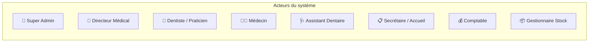
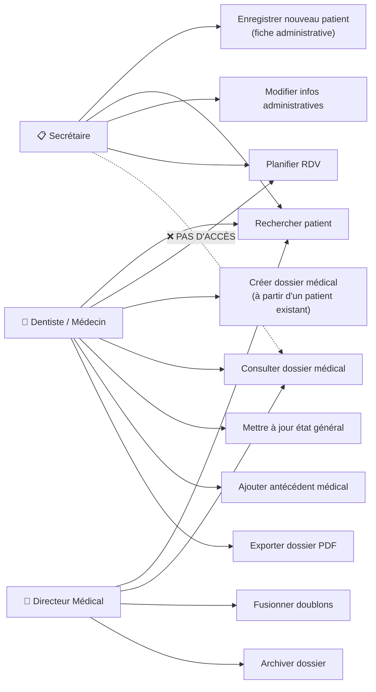
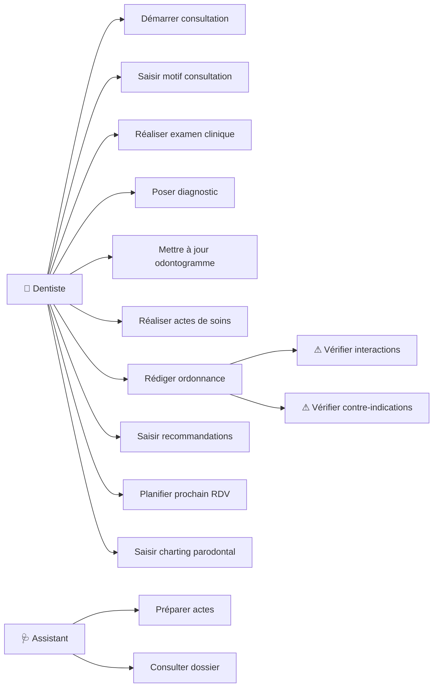
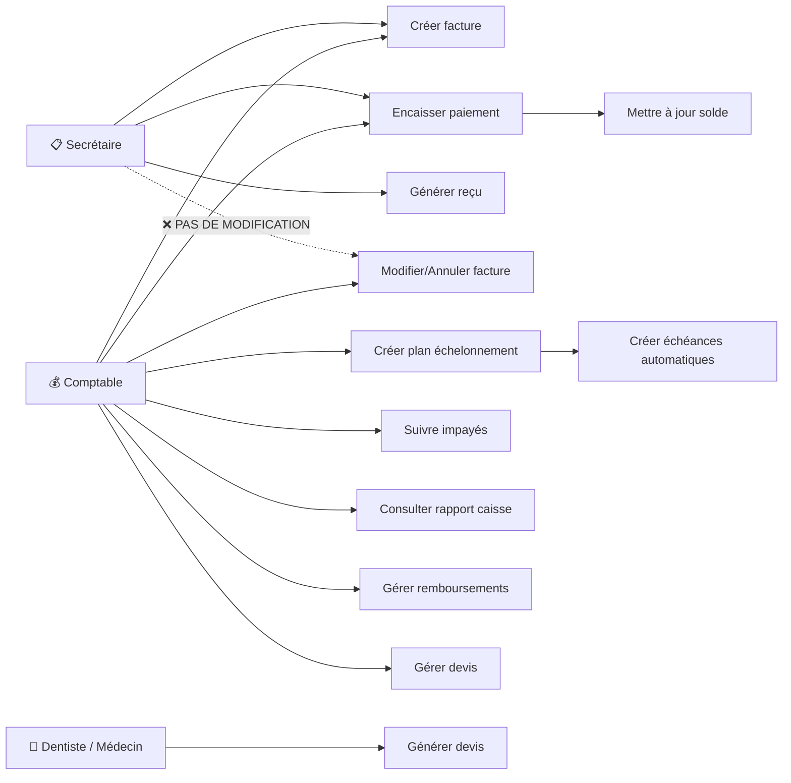
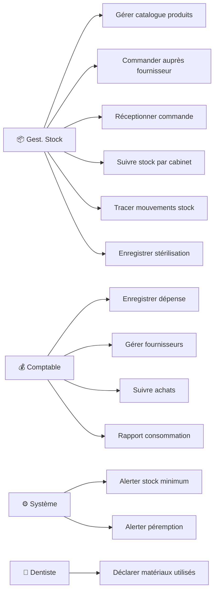
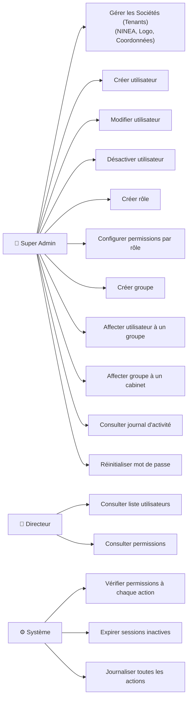

# Diagrammes de Cas d'Utilisation

## Vue globale des acteurs

## Enregistrement Patient & Dossier Médical

!!! important "Séparation claire"
    La secrétaire **enregistre le patient** (fiche administrative). Le médecin/dentiste **crée le dossier médical** à partir du patient enregistré. La secrétaire **n'a pas accès** aux dossiers médicaux.

## Consultation & Soins

## Facturation & Paiements

!!! important "Droits Secrétaire"
    La secrétaire **crée** les factures mais **ne peut pas les modifier** ni les supprimer. Seuls le comptable et l'admin peuvent modifier/annuler une facture. Le comptable peut également créer des factures si besoin.

## Dépenses, Achats & Stock

## Gestion des Utilisateurs, Groupes & Rôles

