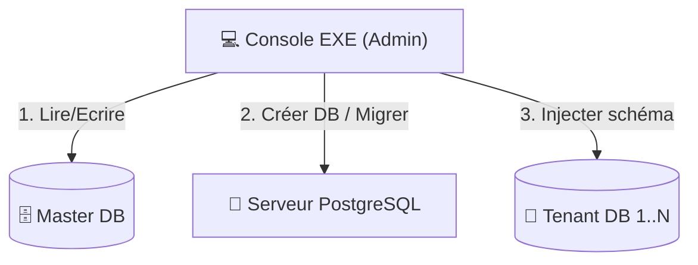

# Console d'Administration (Provisioning Tool)

La **Console SysDent** est un outil utilitaire (exécutable) destiné aux administrateurs système pour gérer le cycle de vie des dossiers (cabinets/sociétés).

## 1. Rôle et Utilité
Contrairement au Backend qui gère les requêtes des utilisateurs finaux, la Console s'occupe de la **structure** du système. Son rôle principal est d'automatiser tout ce qui serait trop complexe ou risqué à faire manuellement.

### Fonctions clés :
- **Provisionnement** : Création automatique d'une nouvelle base de données pour un client.
- **Initialisation** : Déploiement du schéma initial et des données de référence (nomenclatures, rôles par défaut).
- **Maintenance** : Mise à jour synchronisée de toutes les bases de données lors des montées de version.
- **Migration** : Exécution des scripts Alembic sur l'ensemble des dossiers.

## 2. Importance
Dans une architecture multi-base, l'erreur humaine est le plus grand risque. La console garantit que :
- Toutes les bases de données sont **strictement identiques** en termes de version de schéma.
- Le processus de création d'un nouveau cabinet prend **quelques secondes** au lieu de plusieurs minutes.
- Les sauvegardes sont centralisées et cohérentes.

## 3. Architecture & Structure

La console fonctionne comme une couche d'orchestration entre le Superviseur (Master DB) et le serveur PostgreSQL.

### Structure du projet Console :
- `provisioning/` : Logique de création de base de données.
- `migrations/` : Scripts Alembic partagés avec le Backend.
- `seeds/` : Données par défaut (actes de soins, configurations).
- `cli/` : Interface en ligne de commande pour les admins.

## 4. Technologies
Pour rester cohérent avec le reste du projet tout en produisant un outil autonome :

- **Langage** : Python 3.12 (partage de la logique ORM avec le Backend).
- **ORM** : SQLAlchemy / SQLModel.
- **Migrations** : Alembic (pour gérer les versions de base de données).
- **Packaging** : **PyInstaller** pour transformer le script Python en un fichier `.exe` indépendant.
- **CLI** : Typer (pour une interface de commande intuitive).

## 5. Workflow de création d'un dossier
1. **Saisie** : L'admin saisit le nom de la société et le NINEA dans la console.
2. **Master Update** : La console crée l'entrée dans la table `societes` de la base Master.
3. **DB Creation** : La console exécute `CREATE DATABASE sysdent_client_xyz`.
4. **Migration** : La console lance `alembic upgrade head` sur la nouvelle base.
5. **Admin Seed** : Création du premier compte "Directeur Médical" pour ce cabinet.
6. **Validation** : Test de connexion et génération du certificat de dossier.
