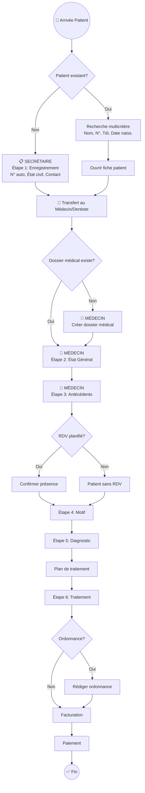

# Parcours Patient complet

```mermaid
flowchart TD
    START(("🏥 Arrivée Patient")) --> Q1{"Patient existant?"}

    Q1 -->|Non| E1["📋 SECRÉTAIRE<br/>Étape 1: Enregistrement<br/>N° auto, État civil, Contact"]
    Q1 -->|Oui| SEARCH["Recherche multicritère<br/>Nom, N°, Tél, Date naiss."]
    SEARCH --> OPEN["Ouvrir fiche patient"]

    E1 --> HANDOFF["🔄 Transfert au Médecin/Dentiste"]
    OPEN --> HANDOFF
    HANDOFF --> QDM{"Dossier médical existe?"}
    QDM -->|Non| CDM["🦷 MÉDECIN<br/>Créer dossier médical"]
    QDM -->|Oui| E2
    CDM --> E2["🦷 MÉDECIN<br/>Étape 2: État Général"]

    E2 --> E3["🦷 MÉDECIN<br/>Étape 3: Antécédents"]
    E3 --> RDV{"RDV planifié?"}
    RDV -->|Oui| CONFIRM["Confirmer présence"]
    RDV -->|Non| WALK_IN["Patient sans RDV"]
    CONFIRM --> E4
    WALK_IN --> E4

    E4["Étape 4: Motif"] --> E5
    E5["Étape 5: Diagnostic"] --> PLAN
    PLAN["Plan de traitement"] --> E6
    E6["Étape 6: Traitement"] --> PRESC
    PRESC{"Ordonnance?"} -->|Oui| ORD["Rédiger ordonnance"]
    PRESC -->|Non| FACT
    ORD --> FACT["Facturation"]
    FACT --> PAY["Paiement"]
    PAY --> FIN(("✅ Fin"))
```
