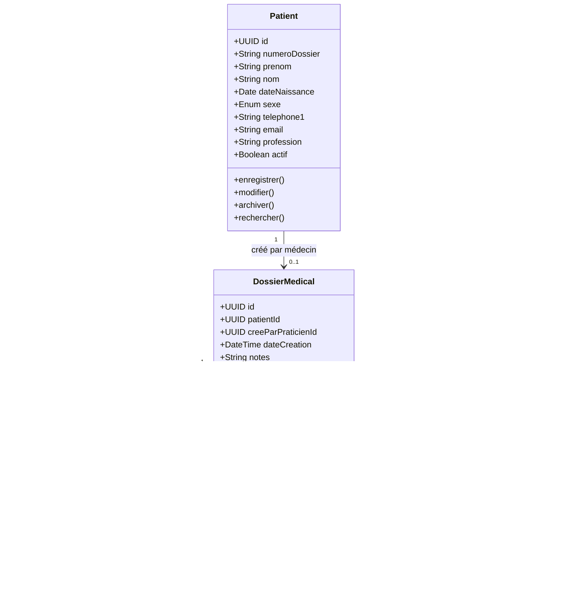
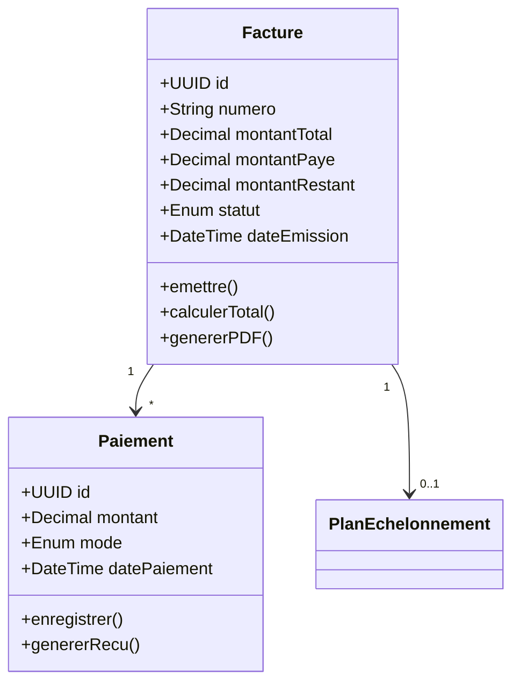
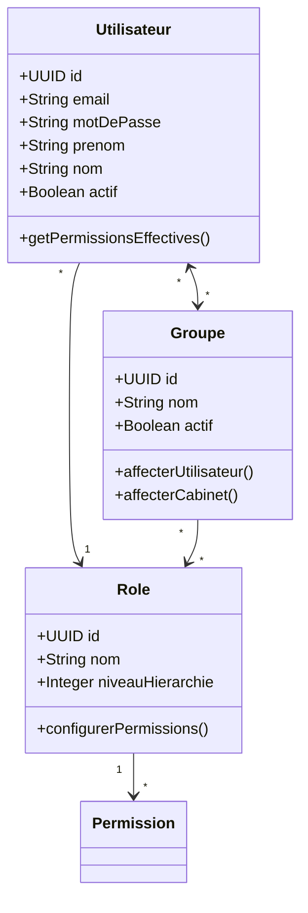

# Diagramme de Classes UML

## Noyau Médical

```mermaid
classDiagram
    class Patient {
        +UUID id
        +String numeroDossier
        +String prenom
        +String nom
        +Date dateNaissance
        +Enum sexe
        +String telephone1
        +String email
        +String profession
        +Boolean actif
        +enregistrer()
        +modifier()
        +archiver()
        +rechercher()
    }

    class DossierMedical {
        +UUID id
        +UUID patientId
        +UUID creeParPraticienId
        +DateTime dateCreation
        +String notes
        +creer()
        +exporterPDF()
    }

    class EtatGeneral {
        +UUID id
        +Boolean grossesse
        +Boolean diabete
        +Boolean hta
        +JSON allergies
        +mettreAJour()
        +verifierContreIndications()
    }

    class Consultation {
        +UUID id
        +String motif
        +String diagnosticPrincipal
        +JSON codesCIM10
        +Enum statut
        +DateTime dateConsultation
        +demarrer()
        +saisirDiagnostic()
        +terminer()
    }

    class Odontogramme {
        +UUID id
        +Enum type
        +generer()
        +exporterPDF()
    }

    Patient "1" --> "0..1" DossierMedical : créé par médecin
    DossierMedical "1" --> "1" EtatGeneral
    DossierMedical "1" --> "*" AntecedentMedical
    DossierMedical "1" --> "*" Consultation
    DossierMedical "1" --> "1" Odontogramme
```

## Facturation

```mermaid
classDiagram
    class Facture {
        +UUID id
        +String numero
        +Decimal montantTotal
        +Decimal montantPaye
        +Decimal montantRestant
        +Enum statut
        +DateTime dateEmission
        +emettre()
        +calculerTotal()
        +genererPDF()
    }

    class Paiement {
        +UUID id
        +Decimal montant
        +Enum mode
        +DateTime datePaiement
        +enregistrer()
        +genererRecu()
    }

    Facture "1" --> "*" Paiement
    Facture "1" --> "0..1" PlanEchelonnement
```

## Utilisateurs & Accès (RBAC)

```mermaid
classDiagram
    class Utilisateur {
        +UUID id
        +String email
        +String motDePasse
        +String prenom
        +String nom
        +Boolean actif
        +getPermissionsEffectives()
    }

    class Role {
        +UUID id
        +String nom
        +Integer niveauHierarchie
        +configurerPermissions()
    }

    class Groupe {
        +UUID id
        +String nom
        +Boolean actif
        +affecterUtilisateur()
        +affecterCabinet()
    }

    Utilisateur "*" --> "1" Role
    Utilisateur "*" <--> "*" Groupe
    Role "1" --> "*" Permission
    Groupe "*" --> "*" Role
```
