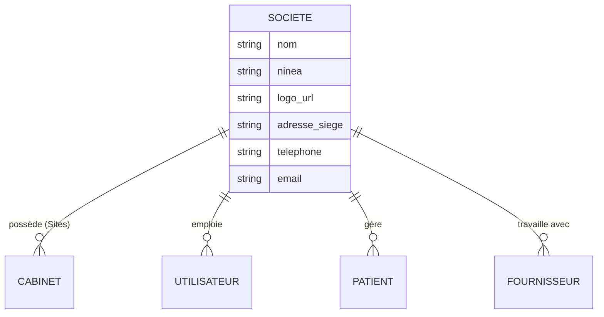
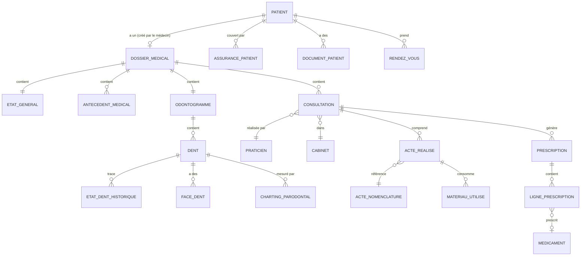
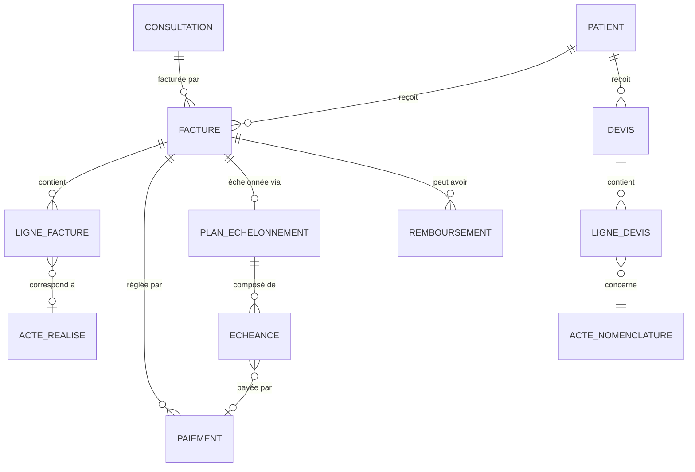
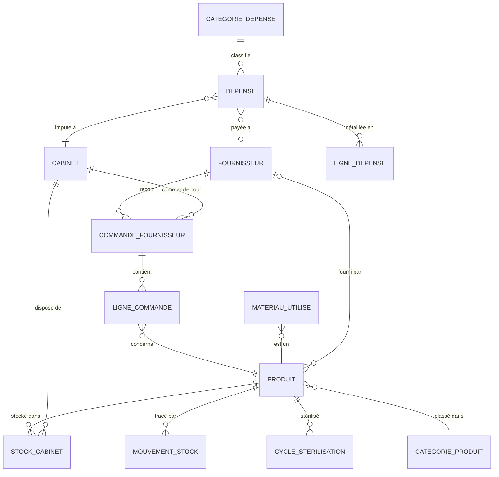
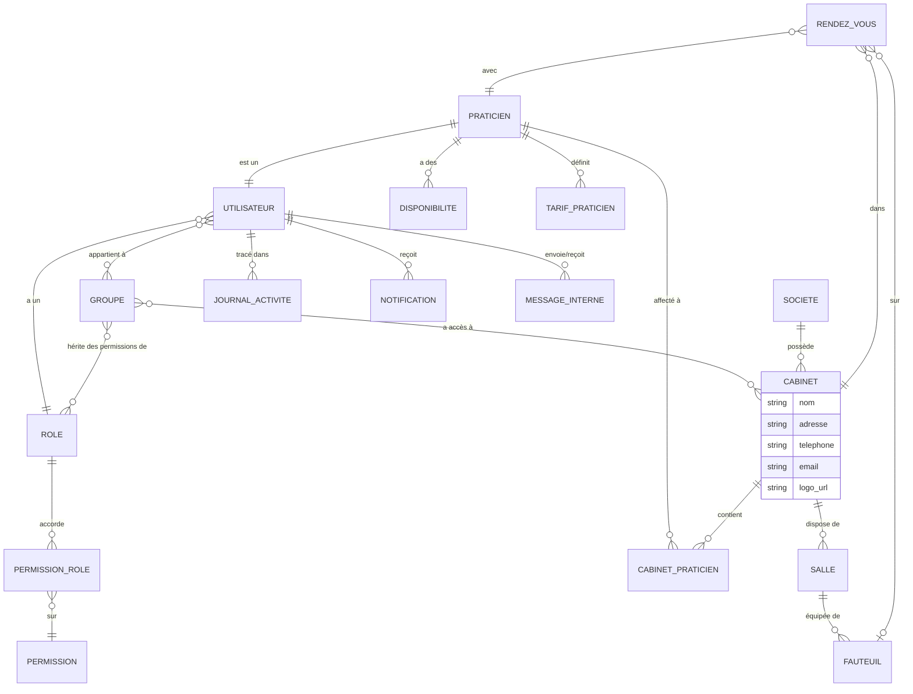

# Modèle Conceptuel de Données (MCD)

## Architecture Multi-Tenant (Structure Sage X3)

Le système est conçu pour être SaaS. Chaque "Société" (Tenant) est isolée des autres.

## Noyau Patient & Médical

!!! important "Provenance des données"
    Le **Patient** (fiche administrative) est créé par la secrétaire. Le **dossier médical** est créé et géré **exclusivement par le médecin/dentiste** à partir d'un patient existant.

## Facturation & Paiements

## Dépenses, Achats & Stock

## Utilisateurs, Groupes & Rôles

