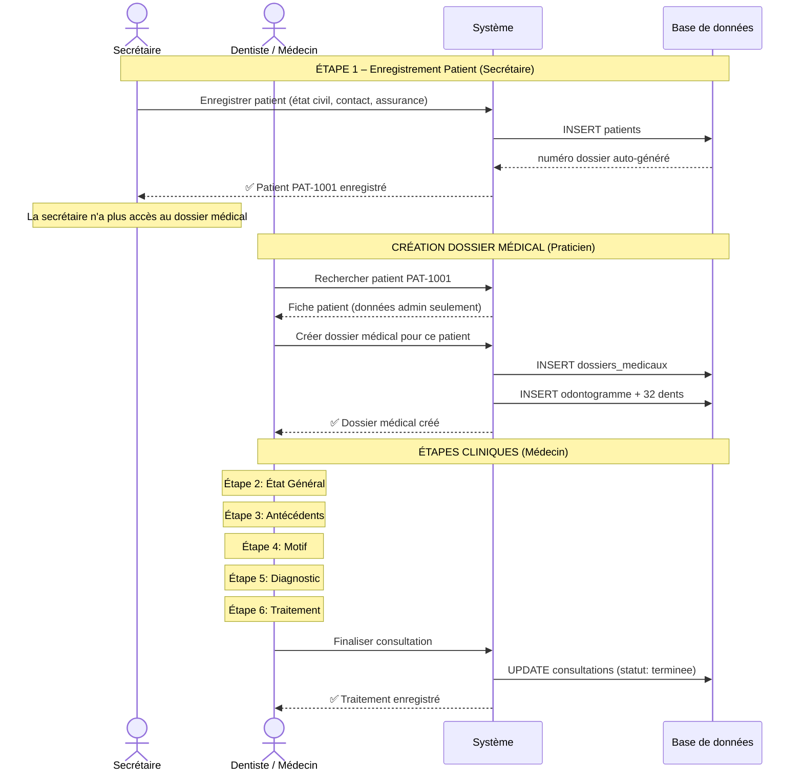
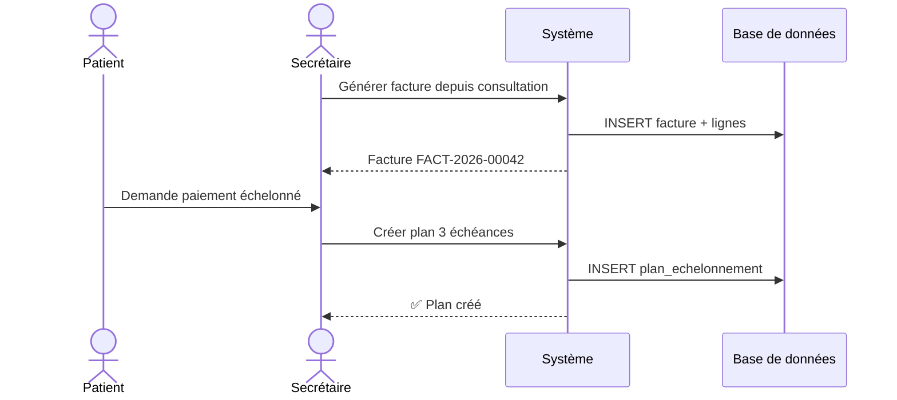

# Diagrammes de Séquence

## Workflow complet du Dossier Patient (6 étapes)

!!! important "Définition des rôles"
    La secrétaire enregistre le patient (étape 1). Le médecin/dentiste crée le dossier médical et gère les étapes 2 à 6.

## Paiement partiel / échelonné

