# SysDent Pro – Modélisation Complète

> Document de modélisation technologiquement neutre.  
> Objectif : définir l'architecture des données et les flux métier **avant** le choix technologique.

---

## Table des matières

1. [Diagramme de Cas d'Utilisation](#1-diagrammes-de-cas-dutilisation)
2. [Modèle Conceptuel de Données (MCD)](#2-modele-conceptuel-de-donnees-mcd)
3. [Diagramme de Classes UML](#3-diagramme-de-classes-uml)
4. [Modèle Logique de Données (MLD)](#4-modele-logique-de-donnees-mld)
5. [Dictionnaire de Données](#5-dictionnaire-de-donnees)
6. [Diagrammes de Séquence](#6-diagrammes-de-sequence)
7. [Diagramme d'Activité – Workflow Patient](#7-diagramme-dactivite)
8. [Règles de Gestion](#8-regles-de-gestion)
9. [Annexe – Suggestions Technologiques](#9-annexe-suggestions-technologiques)

---

## 1. Diagrammes de Cas d'Utilisation

### 1.1 Vue globale des acteurs

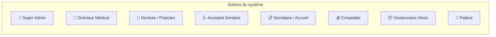

### 1.2 Cas d'utilisation – Gestion des Patients

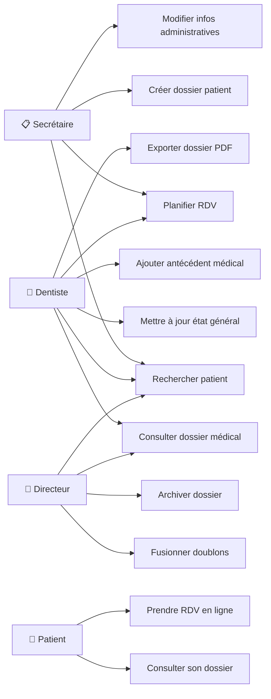

### 1.3 Cas d'utilisation – Consultation & Soins

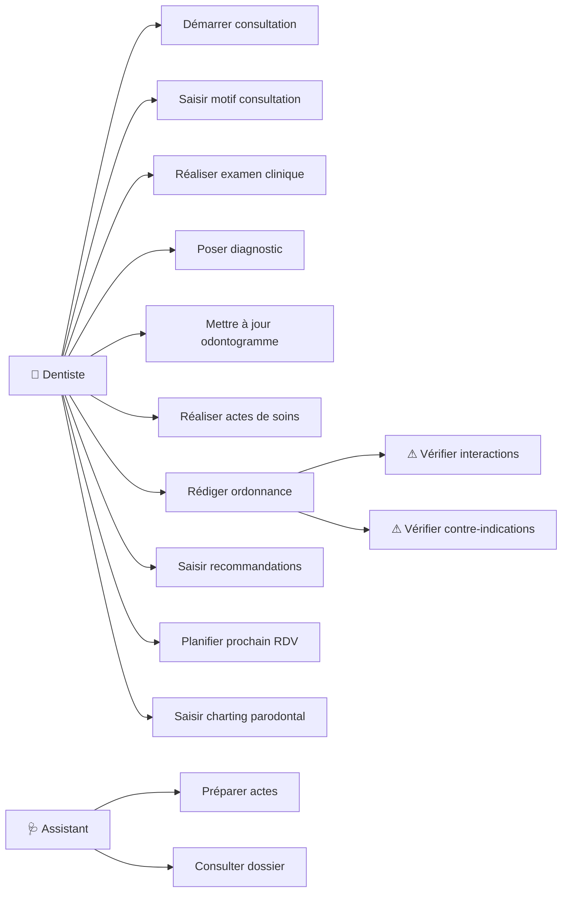

### 1.4 Cas d'utilisation – Facturation & Paiements

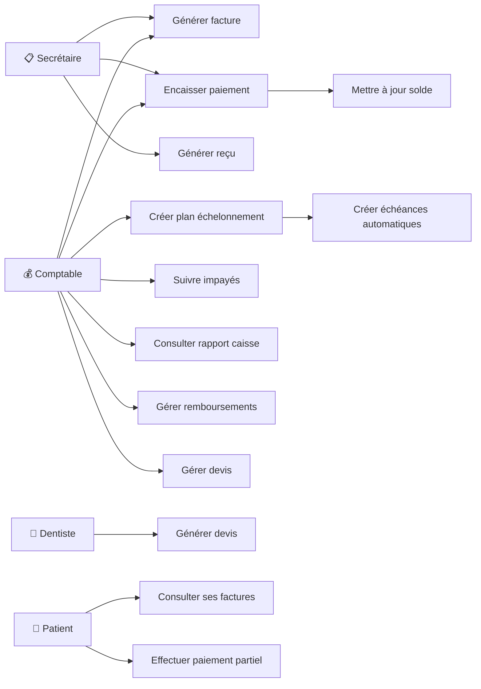

### 1.5 Cas d'utilisation – Dépenses, Achats & Stock

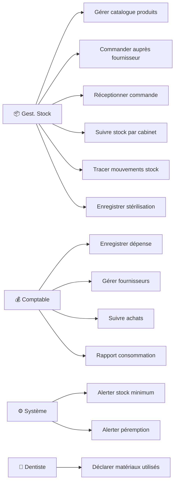

---

## 2. Modèle Conceptuel de Données (MCD)

### 2.1 MCD – Noyau Patient & Médical

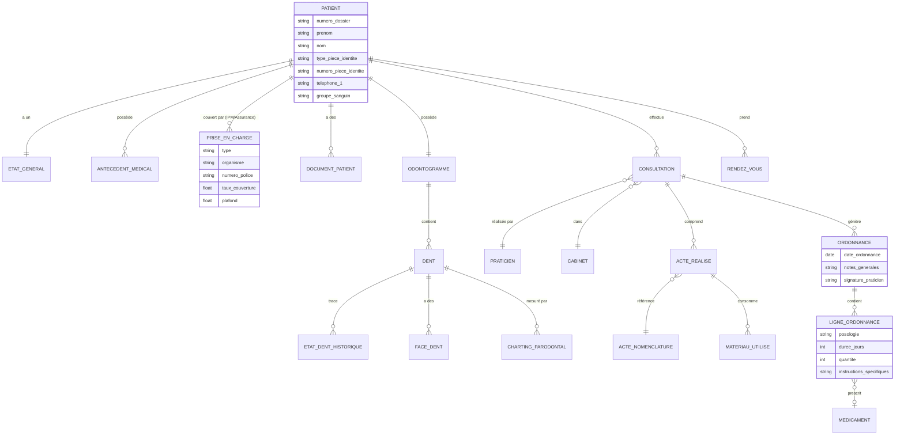

### 2.2 MCD – Facturation & Paiements

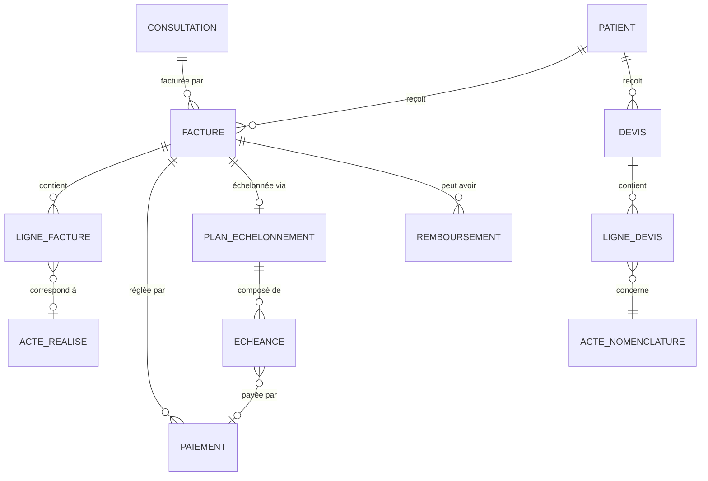

### 2.3 MCD – Dépenses, Achats & Stock

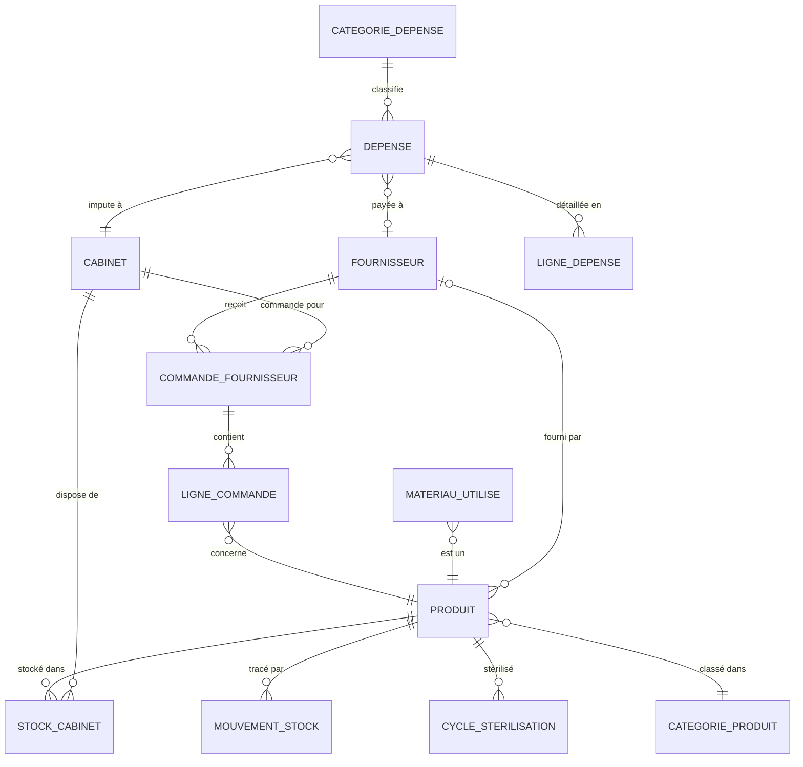

### 2.4 MCD – Organisation & Utilisateurs

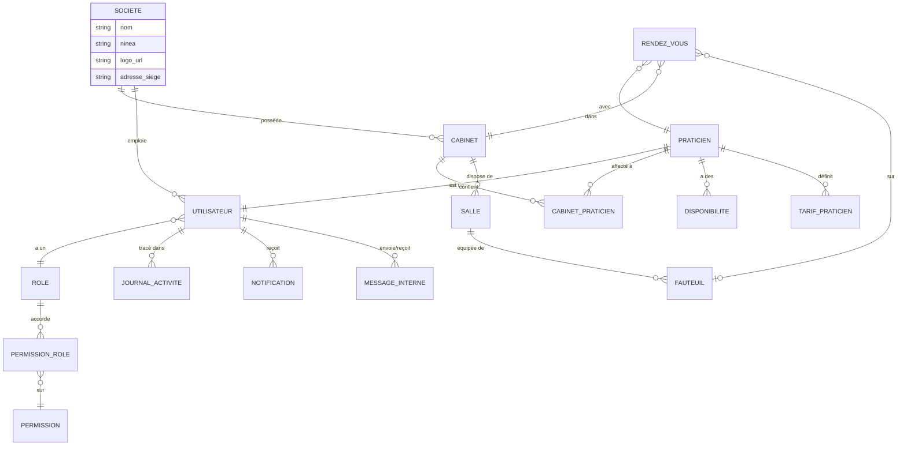

---

## 3. Diagramme de Classes UML

### 3.1 Classes principales

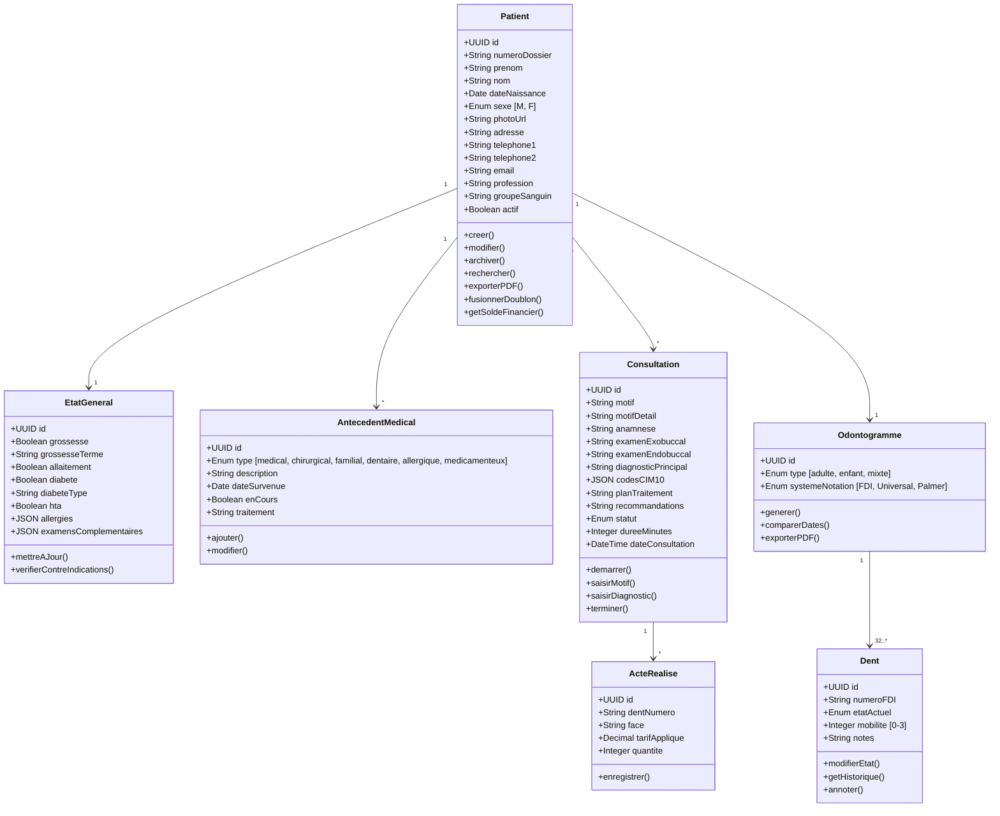

### 3.2 Classes Facturation

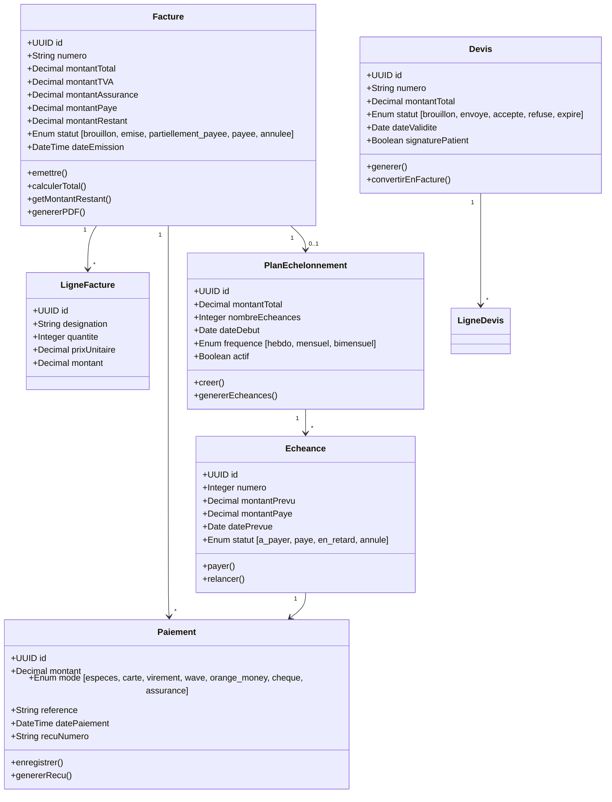

### 3.3 Classes Stock & Dépenses

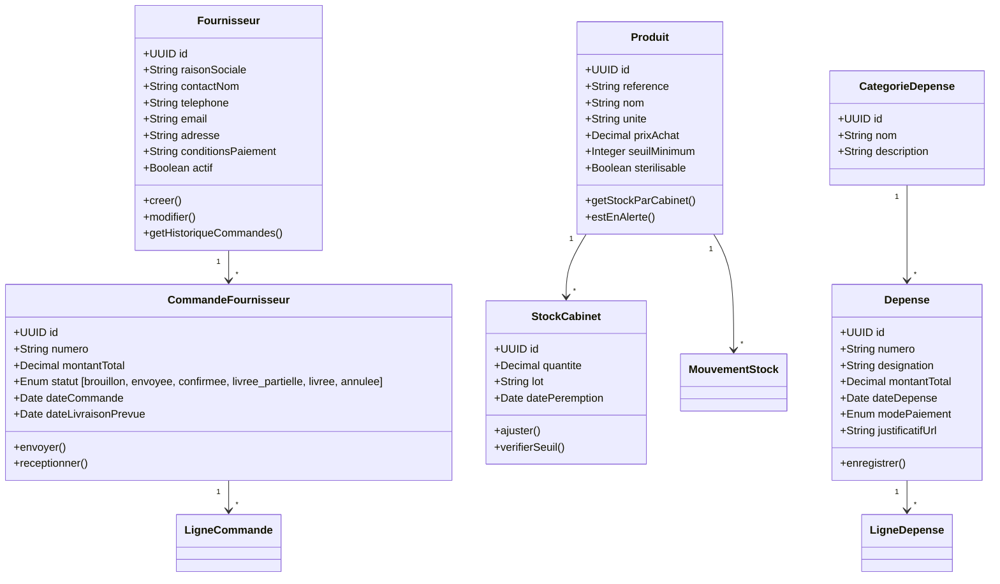

---

## 4. Modèle Logique de Données (MLD)

> Notation: **table**(*PK*, attributs, #FK)

!!! info "Audit & Traçabilité"
    Toutes les tables incluent systématiquement les champs **id** (UUID), **created_at** et **updated_at** pour le suivi des données.

### 4.1 Authentification & RBAC

- **roles**(*id*, nom, description)
- **permissions**(*id*, module, action, description)
- **permission_roles**(*#role_id*, *#permission_id*, scope)
- **utilisateurs**(*id*, email, mot_de_passe, #role_id, prenom, nom, telephone, photo_url, actif, deux_facteurs, secret_2fa, dernier_login)
- **sessions**(*id*, #utilisateur_id, token, ip_address, user_agent, expire_at)

### 4.2 Cabinets & Praticiens

- **cabinets**(*id*, nom, adresse, ville, telephone, email, logo_url, horaires_ouverture[JSON], actif)
- **salles**(*id*, #cabinet_id, nom, etage)
- **fauteuils**(*id*, #salle_id, numero, equipements[JSON], actif)
- **praticiens**(*id*, #utilisateur_id, titre, specialite, numero_ordre, signature_url, bio)
- **cabinet_praticiens**(*id*, #cabinet_id, #praticien_id, date_debut, date_fin, actif)
- **disponibilites**(*id*, #praticien_id, #cabinet_id, jour_semaine, heure_debut, heure_fin, recurrent, date_specifique, type)

### 4.3 Patients & Dossier Médical

- **patients**(*id*, numero_dossier[AUTO], prenom, nom, date_naissance, sexe, type_piece_identite[ENUM], numero_piece_identite, photo_url, adresse, ville, telephone_1, telephone_2, email, profession, employeur, groupe_sanguin, #praticien_habituel_id, #utilisateur_id, source, notes, actif, archive)
- **etats_generaux**(*id*, #patient_id, grossesse, grossesse_terme, allaitement, diabete, diabete_type, diabete_traitement, hta, hta_traitement, allergies[JSON], tabac, alcool, autres_conditions[JSON], examens_complementaires[JSON], #mis_a_jour_par)
- **antecedents_medicaux**(*id*, #patient_id, type[ENUM], description, date_survenue, en_cours, traitement, notes)
- **prises_en_charge**(*id*, #patient_id, type_prise_en_charge[ENUM], organisme, numero_police, taux_couverture, plafond, date_debut, date_fin, actif)
- **documents_patients**(*id*, #patient_id, type, nom_fichier, fichier_url, taille_octets, mime_type, description, #uploaded_by)

### 4.4 Consultations

- **consultations**(*id*, #patient_id, #praticien_id, #cabinet_id, #rendez_vous_id, #fauteuil_id, motif, motif_detail, anamnese, examen_exobuccal, examen_endobuccal, examen_parodontal, diagnostic_principal, diagnostics_differentiels, codes_cim10[JSON], plan_traitement, recommandations, prochain_rdv_prevu, statut[ENUM], duree_minutes, date_consultation)
- **actes_nomenclature**(*id*, code, libelle, categorie, tarif_base, duree_estimee_min, description, actif)
- **tarifs_praticien**(*id*, #acte_id, #praticien_id, tarif)
- **actes_realises**(*id*, #consultation_id, #acte_id, dent_numero, face, description, tarif_applique, quantite, notes)
- **materiaux_utilises**(*id*, #acte_realise_id, #produit_id, quantite, lot)

### 4.5 Ordonnances

- **medicaments**(*id*, nom_commercial, dci, forme, dosage, contre_indications[JSON], interactions[JSON], actif)
- **ordonnances**(*id*, #consultation_id, #praticien_id, #patient_id, date_ordonnance, notes_generales, signature_praticien)
- **lignes_ordonnance**(*id*, #ordonnance_id, #medicament_id, medicament_texte, posologie, duree, quantite, instructions_specifiques)

### 4.6 Odontogramme

- **odontogrammes**(*id*, #patient_id[UNIQUE], type, systeme_notation)
- **dents**(*id*, #odontogramme_id, numero_fdi, numero_universal, etat_actuel[ENUM], mobilite, notes)
- **etats_dents_historique**(*id*, #dent_id, etat[ENUM], face, #consultation_id, #praticien_id, notes, date_constat)
- **faces_dents**(*id*, #dent_id, face, etat[ENUM])
- **chartings_parodontaux**(*id*, #dent_id, #consultation_id, sondages[JSON], nac, recession, saignement_bop, suppuration, mobilite, furcation, plaque_ipv, date_examen)

### 4.7 Rendez-vous

- **rendez_vous**(*id*, #patient_id, #praticien_id, #cabinet_id, #fauteuil_id, date_heure, duree_minutes, motif, type_acte, notes, statut[ENUM], rappel_sms, rappel_email, rappel_envoye, recurrent, recurrence_rule, #pris_par)
- **liste_attente**(*id*, #patient_id, #praticien_id, #cabinet_id, motif, priorite, date_souhaitee, creneau_prefere, statut)

### 4.8 Facturation & Paiements

- **factures**(*id*, numero[AUTO], #patient_id, #consultation_id, #cabinet_id, #praticien_id, montant_total, montant_tva, taux_tva, montant_assurance, taux_assurance, montant_paye, montant_restant[CALCULÉ], statut[ENUM], date_emission, date_echeance, notes, #emis_par)
- **lignes_facture**(*id*, #facture_id, #acte_realise_id, designation, quantite, prix_unitaire, montant[CALCULÉ], tva_applicable)
- **paiements**(*id*, #facture_id, #patient_id, montant, mode[ENUM], reference, date_paiement, recu_numero, notes, #enregistre_par)
- **plans_echelonnement**(*id*, #facture_id, #patient_id, montant_total, nombre_echeances, date_debut, frequence, notes, actif)
- **echeances**(*id*, #plan_id, numero, montant_prevu, montant_paye, date_prevue, date_paiement, #paiement_id, statut)
- **devis**(*id*, numero, #patient_id, #praticien_id, #cabinet_id, montant_total, statut[ENUM], date_validite, signature_patient, date_signature, notes)
- **lignes_devis**(*id*, #devis_id, #acte_id, designation, dent_numero, quantite, prix_unitaire, montant[CALCULÉ])
- **remboursements**(*id*, #facture_id, #patient_id, montant, motif, mode[ENUM], reference, #effectue_par)

### 4.9 Dépenses & Fournisseurs

- **fournisseurs**(*id*, raison_sociale, contact_nom, telephone, email, adresse, ville, pays, site_web, conditions_paiement, notes, actif)
- **categories_depenses**(*id*, nom, description, #parent_id)
- **depenses**(*id*, numero, #cabinet_id, #categorie_id, #fournisseur_id, designation, montant_total, date_depense, mode_paiement[ENUM], reference_paiement, justificatif_url, notes, #enregistre_par)
- **lignes_depense**(*id*, #depense_id, designation, quantite, prix_unitaire, montant[CALCULÉ])

### 4.10 Stock & Matériel

- **categories_produits**(*id*, nom, description, #parent_id)
- **produits**(*id*, reference, nom, #categorie_id, description, unite, prix_achat, seuil_minimum, sterilisable, #fournisseur_principal_id, actif)
- **stock_cabinet**(*id*, #produit_id, #cabinet_id, quantite, lot, date_peremption)
- **mouvements_stock**(*id*, #produit_id, #cabinet_id, type[ENUM], quantite, lot, reference, #effectue_par, notes)
- **commandes_fournisseurs**(*id*, numero, #fournisseur_id, #cabinet_id, montant_total, statut[ENUM], date_commande, date_livraison_prevue, date_livraison_reelle, notes, #commande_par)
- **lignes_commande**(*id*, #commande_id, #produit_id, designation, quantite_commandee, quantite_recue, prix_unitaire, montant[CALCULÉ])
- **cycles_sterilisation**(*id*, #produit_id, #cabinet_id, date_sterilisation, methode, #operateur_id, lot_indicateur, resultat, prochaine_sterilisation)

### 4.11 Communications & Traçabilité

- **notifications**(*id*, #destinataire_id, #patient_id, canal[ENUM], type, sujet, contenu, statut[ENUM], date_envoi, erreur)
- **messages_internes**(*id*, #expediteur_id, #destinataire_id, sujet, contenu, lu, date_lecture)
- **journal_activite**(*id*, #utilisateur_id, action, module, entite_type, entite_id, details[JSON], ip_address, user_agent)

---

## 5. Dictionnaire de Données

### 5.1 Énumérations

| Nom | Valeurs |
|-----|---------|
| `sexe` | M, F |
| `specialite` | dentisterie_generale, orthodontie, parodontologie, chirurgie, endodontie, implantologie, pedodontie, prothese, esthetique |
| `type_antecedent` | medical, chirurgical, familial, dentaire, allergique, medicamenteux |
| `etat_dent` | saine, absente_extraite, absente_congenitale, incluse, supernumeraire, carie_debutante, carie_avancee, carie_profonde, carie_sous_plombage, obturation_amalgame, obturation_composite, obturation_cvi, inlay, onlay, couronne, tcr, reprise_tcr, apexification, couronne_metal, couronne_ceramique, bridge_pilier, bridge_intermediaire, prothese_partielle, prothese_totale, stellite, implant_pose, couronne_sur_implant, attente_osteointegration, extraction_planifiee, extraction_realisee, resection_apicale, bague, bracket, contention, facette, blanchiment |
| `face_dent` | mesial, distal, vestibulaire, lingual_palatin, occlusal_incisal |
| `statut_consultation` | planifiee, en_cours, terminee, annulee |
| `statut_rdv` | planifie, confirme, en_attente, en_cours, termine, annule_patient, annule_cabinet, absent |
| `statut_facture` | brouillon, emise, partiellement_payee, payee, annulee, remboursee |
| `mode_paiement` | especes, carte_bancaire, virement, mobile_money_wave, mobile_money_orange, cheque, assurance |
| `statut_devis` | brouillon, envoye, accepte, refuse, expire |
| `statut_commande` | brouillon, envoyee, confirmee, livree_partielle, livree, annulee |
| `type_mouvement_stock` | entree_achat, entree_retour, entree_transfert, sortie_utilisation, sortie_perime, sortie_casse, sortie_transfert, ajustement |
| `canal_notification` | sms, email, push, interne |
| `type_disponibilite` | disponible, conge, formation, urgence |

### 5.2 Champs JSON structurés

| Table | Champ | Structure |
|-------|-------|-----------|
| `etats_generaux` | `allergies` | `[{"substance": "str", "reaction": "str", "severite": "legere\|moderee\|grave"}]` |
| `etats_generaux` | `examens_complementaires` | `[{"type": "str", "date": "ISO", "resultat": "str", "fichier_url": "str"}]` |
| `consultations` | `codes_cim10` | `["K02.1", "K05.0"]` |
| `chartings_parodontaux` | `sondages` | `[{"site": "MV\|V\|DV\|ML\|L\|DL", "profondeur": int}]` |
| `cabinets` | `horaires_ouverture` | `{"lundi": {"debut": "08:00", "fin": "18:00"}, ...}` |
| `journal_activite` | `details` | `{"champ": "str", "ancien": "any", "nouveau": "any"}` |

---

## 6. Diagrammes de Séquence

### 6.1 Workflow complet du Dossier Patient (6 étapes)

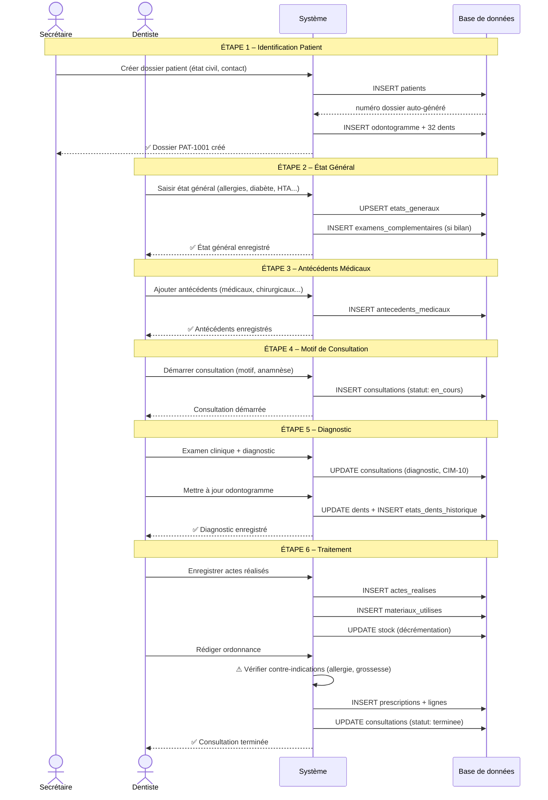

### 6.2 Paiement partiel / échelonné

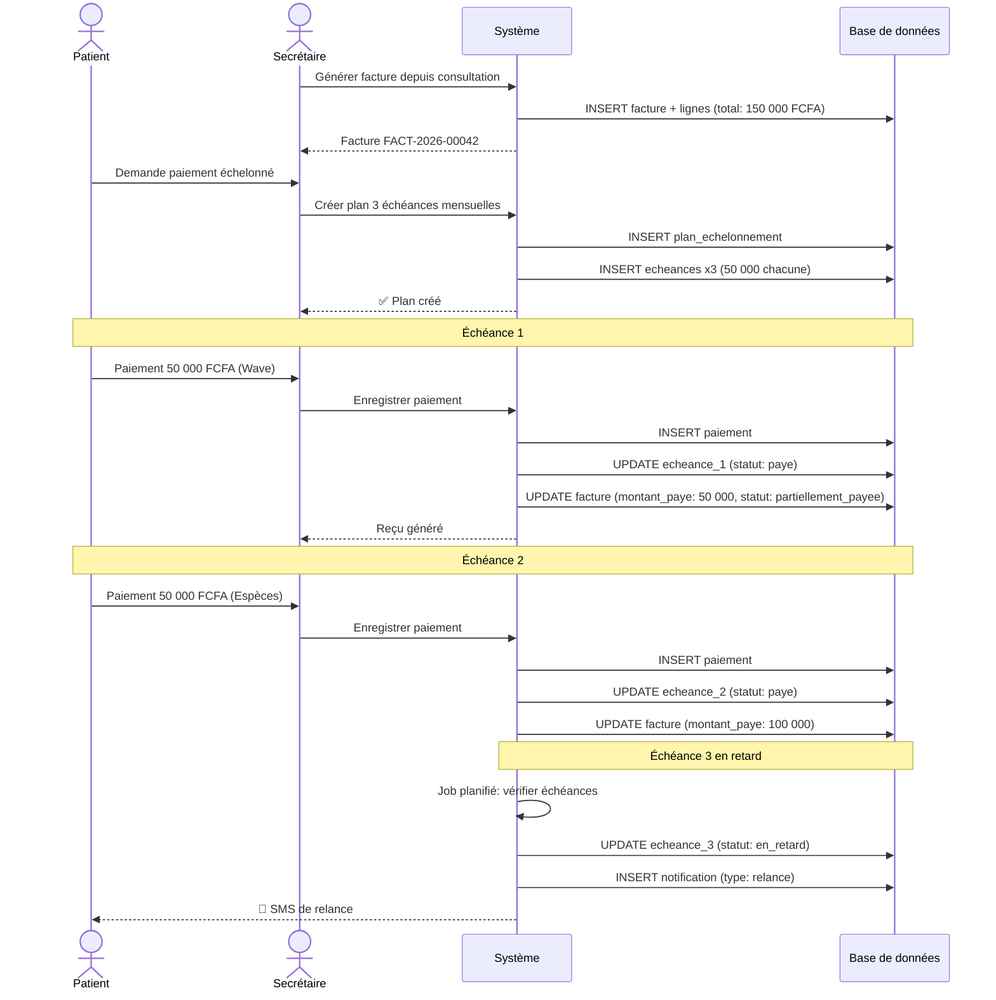

### 6.3 Commande fournisseur et mise à jour stock

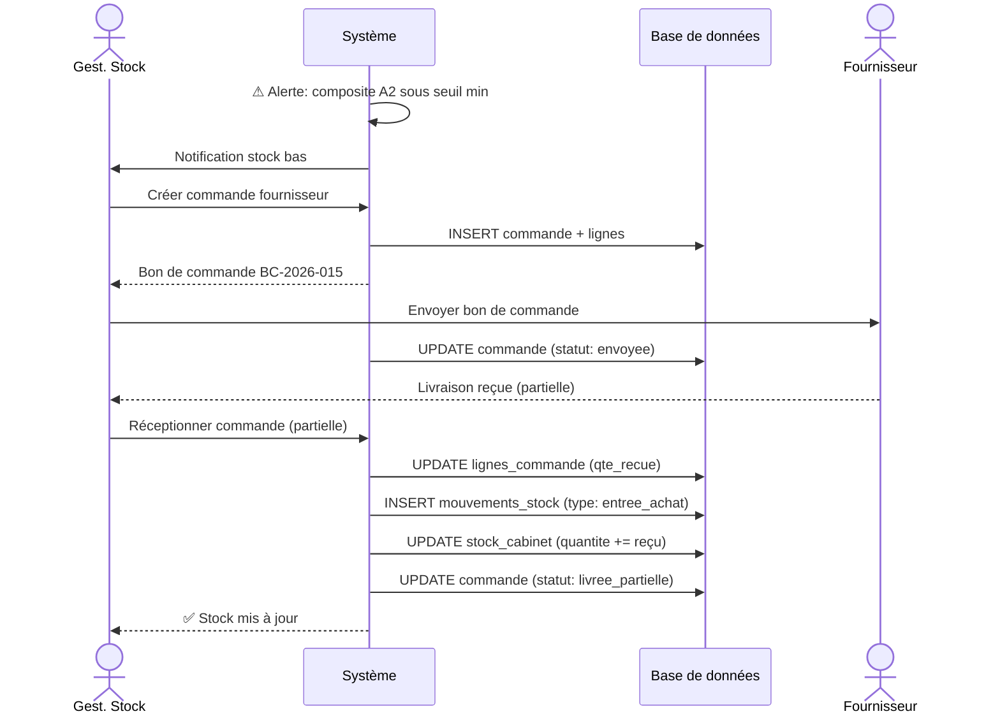

---

## 7. Diagramme d'Activité

### 7.1 Parcours patient complet

```mermaid
flowchart TD
    START(("🏥 Arrivée Patient")) --> Q1{"Patient existant?"}

    Q1 -->|Non| E1["Étape 1: Identification<br/>Création dossier<br/>N° auto, État civil, Contact"]
    Q1 -->|Oui| SEARCH["Recherche multicritère<br/>Nom, N°, Tél, Date naiss."]
    SEARCH --> OPEN["Ouvrir dossier existant"]

    E1 --> E2["Étape 2: État Général<br/>Grossesse, Diabète, HTA<br/>Allergies, Examens complémentaires"]
    OPEN --> Q2{"Mise à jour<br/>état général?"}
    Q2 -->|Oui| E2
    Q2 -->|Non| E3

    E2 --> E3["Étape 3: Antécédents Médicaux<br/>Médicaux, Chirurgicaux<br/>Familiaux, Dentaires"]

    E3 --> RDV{"RDV planifié?"}
    RDV -->|Oui| CONFIRM["Confirmer présence"]
    RDV -->|Non| WALK_IN["Patient sans RDV"]
    CONFIRM --> E4
    WALK_IN --> E4

    E4["Étape 4: Motif de Consultation<br/>Douleur, Contrôle, Urgence<br/>Esthétique, Suivi"] --> E5

    E5["Étape 5: Diagnostic<br/>Examen exo/endo-buccal<br/>Odontogramme, CIM-10"] --> PLAN

    PLAN["Plan de traitement"] --> Q3{"Devis nécessaire?"}
    Q3 -->|Oui| DEVIS["Générer devis<br/>Signature patient"]
    Q3 -->|Non| E6
    DEVIS --> Q4{"Devis accepté?"}
    Q4 -->|Oui| E6
    Q4 -->|Non| END_DEVIS(("Fin – Devis refusé"))

    E6["Étape 6: Traitement<br/>Actes réalisés<br/>Matériaux utilisés"] --> PRESC

    PRESC{"Ordonnance?"}
    PRESC -->|Oui| ORD["Rédiger ordonnance<br/>⚠ Check contre-indications"]
    PRESC -->|Non| FACT
    ORD --> FACT

    FACT["Facturation<br/>Génération facture"] --> PAY{"Mode de paiement?"}

    PAY -->|"💵 Total"| PAY_FULL["Paiement complet<br/>Reçu généré"]
    PAY -->|"📅 Partiel"| PAY_PARTIAL["Plan échelonnement<br/>Échéances créées"]
    PAY -->|"🏛 Assurance"| PAY_ASSUR["Part assurance calculée<br/>Reste à charge patient"]
    PAY_ASSUR --> PAY_REST{"Reste à payer?"}
    PAY_REST -->|Oui| PAY
    PAY_REST -->|Non| PAY_FULL

    PAY_FULL --> NEXT_RDV{"Prochain RDV?"}
    PAY_PARTIAL --> NEXT_RDV
    NEXT_RDV -->|Oui| PLAN_RDV["Planifier RDV<br/>Rappel SMS/Email"]
    NEXT_RDV -->|Non| FIN(("✅ Fin"))
    PLAN_RDV --> FIN
```

---

## 8. Règles de Gestion

| ID | Règle | Module |
|----|-------|--------|
| RG01 | Chaque patient a un numéro de dossier unique auto-généré | Patients |
| RG02 | L'état général doit être vérifié/mis à jour à chaque nouvelle consultation | Patients |
| RG03 | Les allergies déclenchent des alertes automatiques lors de la prescription | Prescriptions |
| RG04 | Les contre-indications (grossesse, allaitement, diabète) bloquent certains médicaments | Prescriptions |
| RG05 | Un acte réalisé décrémente automatiquement le stock des matériaux utilisés | Stock |
| RG06 | Une alerte est émise quand le stock passe sous le seuil minimum | Stock |
| RG07 | Le `montant_restant` d'une facture est calculé automatiquement : `total - assurance - payé` | Facturation |
| RG08 | Un plan d'échelonnement génère automatiquement les échéances selon la fréquence | Paiements |
| RG09 | Les échéances en retard déclenchent une notification SMS au patient | Paiements |
| RG10 | Chaque modification de dent est horodatée avec le praticien et la consultation | Odontogramme |
| RG11 | Un odontogramme adulte comprend 32 dents, un enfant 20 dents | Odontogramme |
| RG12 | Toutes les actions sont tracées dans le journal d'activité (qui, quoi, quand) | Sécurité |
| RG13 | Les données cliniques ne sont accessibles qu'aux rôles médicaux (RBAC) | Sécurité |
| RG14 | Un devis accepté peut être converti automatiquement en facture | Facturation |
| RG15 | Les rappels RDV sont envoyés automatiquement 24h avant | RDV |
| RG16 | Un praticien ne peut avoir de RDV en dehors de ses disponibilités | RDV |
| RG17 | La réception d'une commande met automatiquement à jour le stock | Stock |
| RG18 | Les sessions expirent automatiquement après une période d'inactivité | Sécurité |

---

## 9. Annexe – Suggestions Technologiques

> [!NOTE]
> Section informative. Le choix final sera fait après validation de la modélisation.

### 9.1 Comparatif Backend

| Critère | **Node.js + Express** | **Django REST (Python)** | **FastAPI (Python)** |
|---------|----------------------|-------------------------|----------------------|
| Performance | ⭐⭐⭐⭐ Excellente (async I/O) | ⭐⭐⭐ Bonne | ⭐⭐⭐⭐⭐ Exceptionnelle (Asynchrone) |
| Rapidité de dev | ⭐⭐⭐⭐⭐ Très rapide | ⭐⭐⭐⭐⭐ Très rapide (admin auto) | ⭐⭐⭐⭐⭐ Très rapide (Pydantic/Typage) |
| Sécurité native | ⭐⭐⭐ Moyenne | ⭐⭐⭐⭐⭐ Excellente (CSRF, XSS) | ⭐⭐⭐⭐ Très bonne (OAuth2/JWT) |
| ORM | Prisma (type-safe) | Django ORM (intégré) | SQLAlchemy / SQLModel |
| Écosystème médical | ⭐⭐⭐ Bon | ⭐⭐⭐⭐ Riche (NumPy, Pandas) | ⭐⭐⭐⭐ Riche (Data Science) |
| Scalabilité | ⭐⭐⭐⭐ Horizontale | ⭐⭐⭐ Correcte | ⭐⭐⭐⭐⭐ Nativement asynchrone |
| Recrutement Sénégal | ⭐⭐⭐⭐ Facile | ⭐⭐⭐⭐ Facile | ⭐⭐⭐⭐ En forte progression |
| **Recommandation** | 🔶 Option alternative | 🔶 Si admin auto-générée vitale | ✅ **Choix validé : FastAPI** |

### 9.2 Comparatif Frontend

| Critère | **React.js** | **Vue.js** | **Angular** |
|---------|-------------|-----------|------------|
| Courbe d'apprentissage | ⭐⭐⭐ Moyenne | ⭐⭐⭐⭐⭐ Très facile | ⭐⭐ Raide |
| Composants UI médicaux | ⭐⭐⭐⭐ Riche | ⭐⭐⭐ Bon | ⭐⭐⭐⭐ Material |
| Odontogramme interactif | ⭐⭐⭐⭐⭐ SVG/Canvas excellent | ⭐⭐⭐⭐ Bon | ⭐⭐⭐⭐ Bon |
| Mobile (responsive) | ⭐⭐⭐⭐ NextUI, MUI | ⭐⭐⭐⭐ Vuetify, PrimeVue | ⭐⭐⭐⭐ Angular Material |
| Communauté | ⭐⭐⭐⭐⭐ Très large | ⭐⭐⭐⭐ Large | ⭐⭐⭐⭐ Large |
| **Recommandation** | ✅ **Recommandé** | ✅ **Très bon choix** | 🔶 Pour équipe expérimentée |

### 9.3 Base de données

| | **PostgreSQL** | **MySQL** | **MongoDB** |
|---|--------------|----------|------------|
| Relations complexes | ⭐⭐⭐⭐⭐ Excellentes | ⭐⭐⭐⭐ Bonnes | ⭐⭐ Difficile |
| JSONB (données semi-structurées) | ⭐⭐⭐⭐⭐ Natif | ⭐⭐⭐ Limité | ⭐⭐⭐⭐⭐ Natif |
| Conformité ACID | ⭐⭐⭐⭐⭐ Complète | ⭐⭐⭐⭐ Bonne | ⭐⭐⭐ Partielle |
| Données médicales | ⭐⭐⭐⭐⭐ Standard secteur santé | ⭐⭐⭐ Correct | ⭐⭐ Non recommandé |
| **Recommandation** | ✅ **Fortement recommandé** | 🔶 Acceptable | ❌ Déconseillé pour ce projet |

### 9.4 Recommandation finale

| Composant | Choix recommandé |
|-----------|-----------------|
| **Backend** | **FastAPI** (Python) — performances exceptionnelles, typage statique, doc Swagger automatique |
| **Frontend** | **React.js** avec Next.js — composants riches, SVG pour odontogramme |
| **Base de données** | **PostgreSQL** — conformité ACID, JSONB, standard santé |
| **Cache** | Redis — sessions, file d'attente notifications |
| **Fichiers/Images** | MinIO ou S3 — stockage radios, documents |
| **SMS** | Twilio ou API locale (Orange SMS) |
